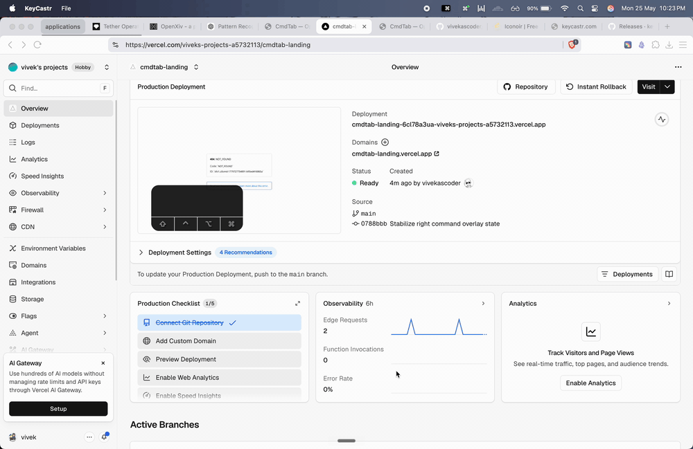

<p align="center">
  
  <br>
  
</p>

<h1 align="center">CmdTab</h1>

CmdTab is a lightweight macOS app switcher that shows a numbered overlay when you hold the right Command key. Select apps with number keys, or assign custom character shortcuts for specific apps.

Landing page: https://cmd-tab.vercel.app/

## Features

- Right Command key app switching overlay
- Block and list overlay layouts
- Ignore list for hiding specific apps from the overlay
- Per-app character shortcuts, such as `o` for Obsidian
- Menu bar settings app

## Build

```bash
./build.sh
open /Users/statemachine/code/CmdTab/CmdTab.app
```

CmdTab requires Accessibility permission so it can monitor the right Command key. The build script prefers a stable local Apple Development signing identity when available, which helps preserve the Accessibility permission across rebuilds.

## Production DMG

Public macOS distribution should use a Developer ID signed and notarized DMG. You need a paid Apple Developer account with these certificates installed in Keychain:

- `Developer ID Application`
- `Developer ID Installer` optional, used to sign the DMG when available

Create a notarization keychain profile once:

```bash
xcrun notarytool store-credentials cmdtab-notary \
  --apple-id "<apple-id>" \
  --team-id "<team-id>" \
  --password "<app-specific-password>"
```

Build, sign, notarize, staple, and verify the DMG:

```bash
NOTARY_PROFILE=cmdtab-notary ./scripts/release_dmg.sh
```

The release asset is written to:

```text
dist/CmdTab.dmg
```

For local testing without notarization:

```bash
NOTARIZE=0 ./scripts/release_dmg.sh
```

Manual notarization commands:

```bash
# Submit the DMG to Apple and wait for the result.
xcrun notarytool submit dist/CmdTab.dmg \
  --keychain-profile cmdtab-notary \
  --wait

# If accepted, staple the ticket to the DMG.
xcrun stapler staple dist/CmdTab.dmg

# Validate the stapled ticket.
xcrun stapler validate dist/CmdTab.dmg

# Gatekeeper assessment check.
spctl --assess --type open \
  --context context:primary-signature \
  --verbose=4 dist/CmdTab.dmg
```

## Landing Page

The vanilla HTML/CSS/JS landing page lives in `LP/` and is deployed on Vercel.

## Things to do

- Logo attached in DMG, app
- Release from github,
- Site should allow downloading .dmg
- Recorded Video demo of the app in action
- twitter thread and video
- Start at startup
